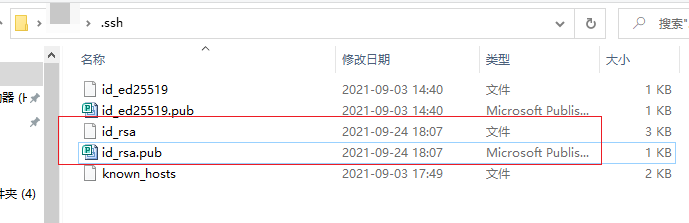
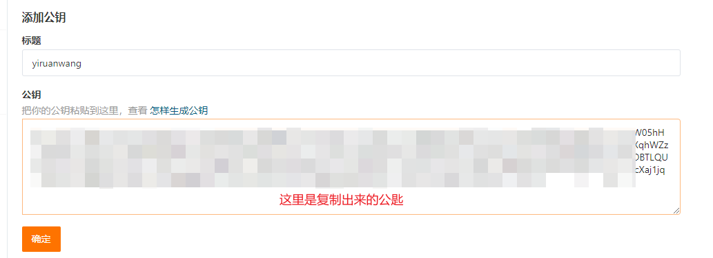

---

title: Github Actions 实现和国内托管站同步
date: 2021-09-24 10:37:41
permalink: /pages/bff5ee/
sticky: 2
categories:
  - 技术
  - GitHub技巧
tags:
  - coding
  - gitee
  - actions
---
# Github Actions 自动同步到Coding.net和Gitee.com上

## 一、Github Actions To Coding.net 同步

### 注册 创建 `Coding` 代码仓库

1. 第一步当然是注册Coding账号了 [注册Coding](http://www.coding.net/)

2. 具体注册步骤不再示范！

   

3. 注册成功后，创建好代码仓库
   

4. 

5. 

6. 

7. 

8. 

### 配置 `Coding` 代码仓库 权限 Token

1. 
2. 

3.添加公匙


4. [点此查看 SSH 公钥使用办法](https://help.coding.net/docs/project/features/ssh.html)

5. 示例：

   >   **git bash 中敲入命令** 

   ```sell
   ssh-keygen -m PEM -t rsa -b 4096 -C "your.email@example.com"
   ```

   

6. **git bash 中敲入命令，会在 ~/.ssh 文件夹下生成 id_rsa.pub【放入coding】 文件内容和 id_rsa 【github】文件内容，分别存放公钥和私钥**


7.我们用IDE编辑器打开 ` id_rsa.pub ` 文件。**全选字符串**复制上

8.输入登陆密码


9.

10.到此为止`Coding.net`公匙配置完毕

### 配置 `Github` 添加私匙

1.进入需要同步的仓库主页面，进入设置界面


2.进入`Secrets`


3.新增一个Secrets


4.回到上述`第6条` .ssh 文件夹下` id_rsa` 文件内容用IDE编辑器打开全选复制上

5.回到github新增Secrets界面粘贴上


6.Github `Secrets` Token 添加完成


### 现在我们回到IDE `Vs code`编辑器打开项目

1. 首先我们在项目中创建一个`.github\workflows`目录

2. 在此目录下创建一个`yml`文件。我这里命名为`github-to-coding.yml`各位随意

3. 在次文件`github-to-coding.yml`中放入以下代码

   ``` yaml
   name: 'GitHub Actions To coding'
   
   on: [push, delete]
   
   
   jobs:
     mirror_to_coding:
       runs-on: ubuntu-latest
       steps:
         - name: 'Checkout'
           uses: actions/checkout@v1
         - name: 'Mirror to coding'
           uses: pixta-dev/repository-mirroring-action@v1
           with:
             target_repo_url:
               git@e.coding.net:qingshu/yiruanwang/docs.git # 这里请看本例第4小节
             ssh_private_key:
               ${{ secrets.CODING_GO }}    # 请看 配置 `Github` 添加私匙        
                 # ssh-keygen -m PEM -t rsa -b 4096 -C "your.email@example.com"
                 # git bash 中敲入命令，会在 ~/.ssh 文件夹下生成 id_rsa.pub【放入coding】 文件内容和 id_rsa 【github】文件内容，分别存放公钥和私钥
                 # 特别注意：两方仓库的分支要一样。不然要报错。不过不影响。主要看着烦！  
   ```

4.上面代码介绍

- 16行仓库地址。这里我们要使用SSH地址
- 
- 18行

5. 完结Coding同步

### 完成我们测试看看。如图


## 二、Github Actions To Gitee.com 同步

### 注册 创建 `Gitee` 代码仓库

#### 1.第一步当然是注册`Gitee`账号了 [注册Gitee](https://gitee.com/)

> 注册就不用描述了，自己看着办。

#### 2.创建组织


#### 3.创建仓库


#### 4.创建公匙


#### 5.添加公匙 [怎样生成公钥](https://gitee.com/help/articles/4191)

> ssh-keygen -t rsa -C "user@email.com"


> git bash 中敲入命令，会在 ~/.ssh 文件夹下生成 id_rsa.pub【放入gitee】 文件内容和 id_rsa 【github】文件内容，分别存放公钥和私钥



> 我们用IDE编辑器打开 ` id_rsa.pub ` 文件。**全选字符串**复制上!




> 到此`Gitee`公匙就完成了 

### 配置添加 `Github`私匙

#### 1.进入需要同步的仓库主页面，进入设置界面`Settings`

::: tip
这里的配置和`Coding`一样,就不做描述了
:::

#### 2.进入`Secrets`
#### 3.新增一个Secrets
> .ssh 文件夹下`id_rsa` 文件内容用IDE编辑器打开全选复制上


### 现在我们回到IDE `Vs code`编辑器打开项目

#### 1. 首先我们在项目中创建一个`.github\workflows`目录

#### 2. 在此目录下创建一个`yml`文件。我这里命名为`github-to-gitee.yml`各位随意

#### 3. 在次文件`github-to-gitee.yml`中放入以下代码

   ``` yaml
   name: 'GitHub Actions To Gitee'
   
   on: [push, delete]
   
   jobs:
     mirror_to_gitee:
       runs-on: ubuntu-latest
       steps:
         - name: 'Checkout'
           uses: actions/checkout@v1
         - name: 'Mirror to gitee'
           uses: pixta-dev/repository-mirroring-action@v1
           with:
             target_repo_url:
               git@gitee.com:yiruanwang/docs.git
             ssh_private_key:
               ${{ secrets.GITEE_GO }}
                 # ssh-keygen -t rsa -C "user@email.com"
                 # git bash 中敲入命令，会在 ~/.ssh 文件夹下生成 id_rsa.pub【放入gitee】 文件内容和 id_rsa 【github】文件内容，分别存放公钥和私钥
                 # 特别注意：两方仓库的分支要一样。不然要报错。不过不影响。主要看着烦！
   ```

#### 4.上面代码介绍

- 15行仓库地址。这里我们要使用SSH地址
- 
- 17行

#### 5. 完结`Gitee`同步

### 完成我们测试看看。如图


## 三、完毕


[回到顶部](#注册-创建-coding-代码仓库)


